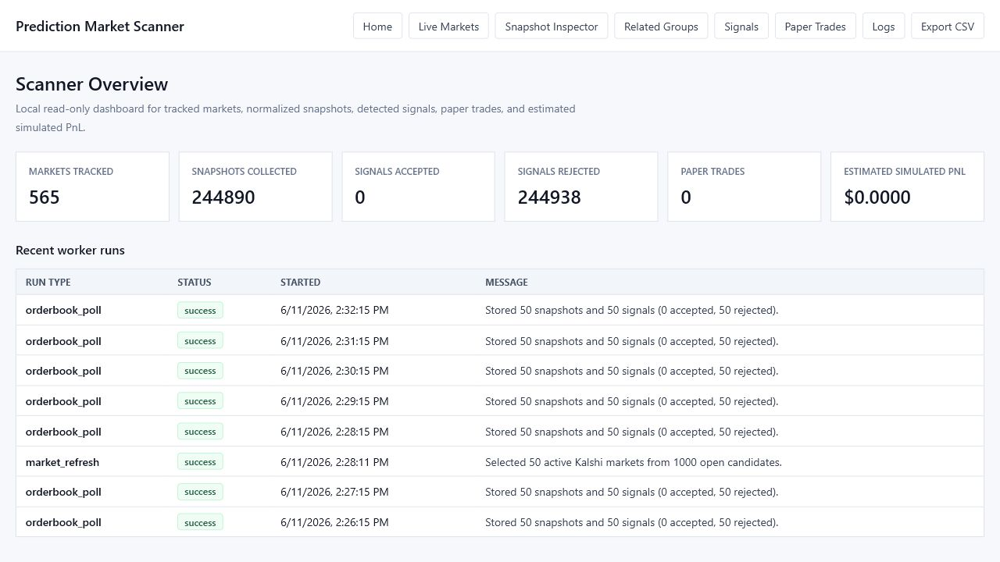
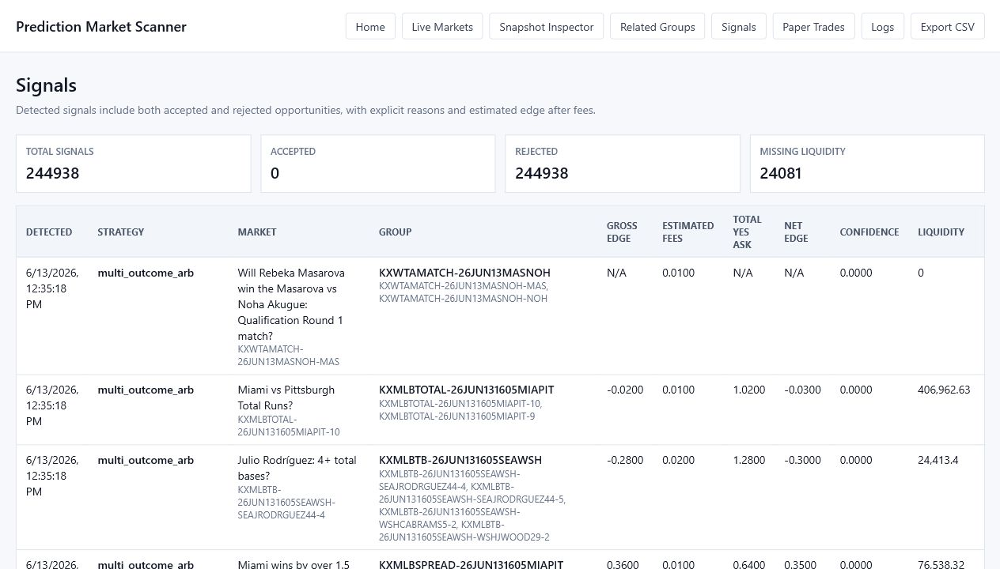
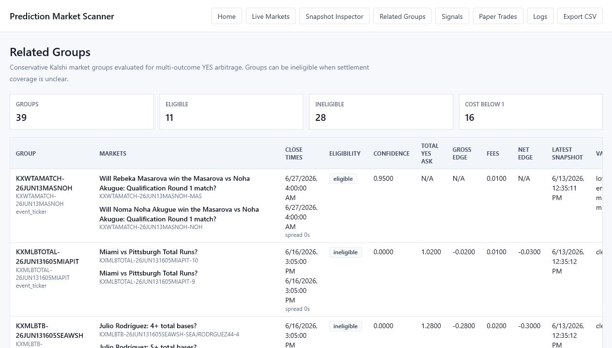
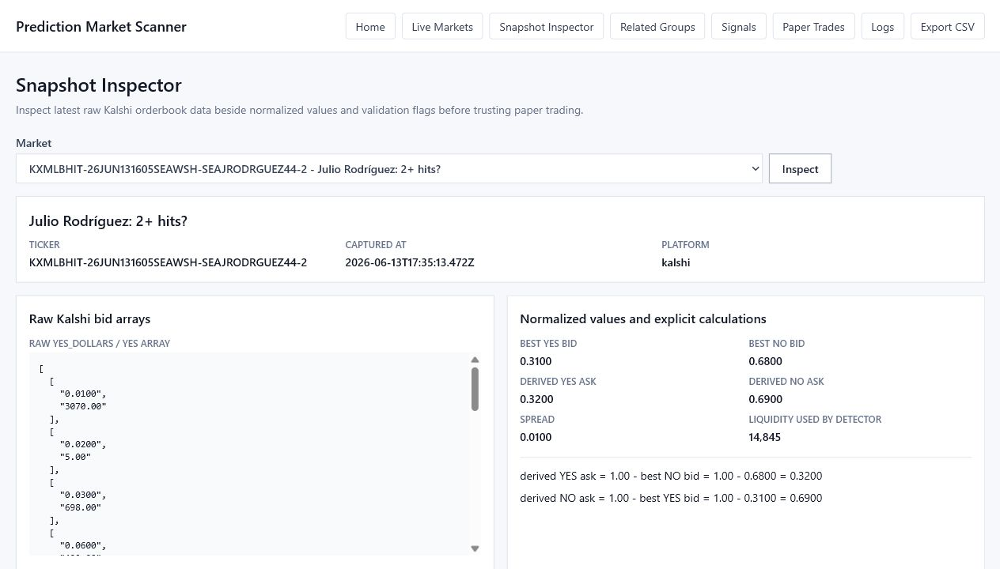

# Prediction Market Intelligence Platform

A read-only market microstructure research platform for studying prediction market inefficiencies, spread tightening, passive quote markout, and execution realism using Kalshi market and orderbook snapshots.

**Status:** MVP / research prototype. This is not a trading bot, does not place trades, and does not use authenticated order placement.

## Problem

Prediction market orderbooks can appear to show simple pricing inefficiencies, but naive signals often disappear after liquidity, fees, stale data, and execution realism are considered. This project explores that gap: it collects public market data, normalizes orderbooks into inspectable research datasets, evaluates signal quality, and makes the limitations visible instead of treating a descriptive edge as a tradable strategy.

## Why This Project Matters

This project demonstrates market data ingestion, normalized data modeling, TypeScript monorepo architecture, research tooling, backtesting-style analysis, testing discipline, and honest quant research methodology. The emphasis is not on claiming profitability; it is on building the software and research workflow needed to separate promising market structure from execution constraints.

## Architecture

```text
Kalshi public API
  -> worker collection jobs
  -> orderbook normalization
  -> Postgres / Prisma storage
  -> research and detector modules
  -> local Next.js dashboard
```

- `apps/web`: Next.js dashboard for inspecting markets, snapshots, signals, related groups, logs, simulated paper trades, and CSV exports.
- `apps/worker`: Node.js collection and research commands for Kalshi snapshots, detectors, reports, and summary output.
- `packages/core`: Shared normalization, validation, market grouping, research, detector, CSV, fee-buffer, and paper-simulation logic.
- `packages/db`: Prisma schema, generated client setup, and Postgres migrations.

## Key Features

- Read-only Kalshi market and orderbook ingestion.
- YES/NO bid-only orderbook normalization into derived bid/ask views.
- Snapshot validation for missing books, stale data, invalid prices, crossed markets, and incomplete liquidity.
- Binary complement and related-market signal evaluation with conservative rejection reasons.
- Spread-tightening, spread-persistence, forward-return, maker-quote, fill-proxy, and quote-aggressiveness research commands.
- Local dashboard pages for home, live markets, snapshot inspector, related groups, signals, paper trades, logs, and CSV export.
- Vitest coverage for parsing, normalization, grouping, validation, detector behavior, research reports, and worker configuration.

## Research Findings

The original binary complement arbitrage baseline was weak: low-edge rejected signals were consistently negative, and the best observed net edge did not support loosening thresholds.

The stronger descriptive signal came from spread tightening. Wider-spread markets in the sample tightened more often, especially in the `0.04-0.10` entry spread range. Some wide-spread episodes persisted long enough to be worth studying rather than dismissing as one-snapshot noise.

Passive `bid_plus_tick` quote simulations showed strong future midpoint markout before fill constraints. The unresolved issue is execution realism: conservative quotes had stronger markout but lower estimated fillability, while more aggressive quotes improved fillability and tended to reduce or destroy the edge.

**Current conclusion:** spread-tightening and passive quote markout are promising descriptive signals, but tradability requires better fill modeling, trade history, queue-position assumptions, or an event-driven backtester.

## Local Setup

```powershell
npm install
Copy-Item .env.example .env -Force
docker compose up -d
npm run db:generate
npm run db:migrate
npm run dev
```

In another terminal, start the worker:

```powershell
$env:MAX_MARKETS="50"
$env:KALSHI_CANDIDATE_MARKET_LIMIT="1000"
$env:INCLUDE_MVE_MARKETS="false"
$env:POLL_INTERVAL_SECONDS="60"
$env:PAPER_EXECUTION_DELAY_SECONDS="30"
$env:MIN_NET_EDGE="0.01"
npm run worker
```

Collect a bounded live-data sample:

```powershell
$env:MAX_MARKETS="100"
$env:KALSHI_CANDIDATE_MARKET_LIMIT="2000"
$env:SAMPLE_DURATION_SECONDS="600"
npm run collect:sample
```

## Environment Variables

Do not commit real `.env` files.

| Variable | Purpose |
| --- | --- |
| `DATABASE_URL` | Postgres connection string for Prisma. |
| `KALSHI_BASE_URL` | Public Kalshi API base URL. |
| `MAX_MARKETS` | Max selected markets per cycle. |
| `KALSHI_CANDIDATE_MARKET_LIMIT` | Number of candidate markets considered before selection. |
| `INCLUDE_MVE_MARKETS` | Whether to include multivariate markets, defaults false. |
| `POLL_INTERVAL_SECONDS` | Worker polling interval. |
| `SAMPLE_DURATION_SECONDS` | Bounded sample collection duration. |
| `MIN_NET_EDGE` | Minimum net edge threshold for detector acceptance. |

## Research Commands

```powershell
npm run report:overnight
npm run parity:normalized
npm run research:candidates
npm run research:forward-returns
npm run research:spread-tightening
npm run research:spread-persistence
npm run research:spread-candidates
npm run research:maker-quotes
npm run research:fill-proxy
npm run research:quote-sweep
npm run research:summary
npm run research:summary -- --format markdown
```

Example quote-aggressiveness sweep:

```powershell
npm run research:quote-sweep -- --markout-window 240m --fill-window 240m --min-entry-spread 0.04 --max-entry-spread 0.10 --dedupe-by ticker
```

## Testing

```powershell
npm test
npm run lint
npm run build
```

## Limitations And Caveats

- Kalshi only.
- Public read-only market and orderbook data only.
- Polling snapshots, not WebSocket replay.
- Fill proxy uses later orderbook snapshots, not confirmed exchange fills.
- No queue-position, cancellation, adverse-selection, or exact fee modeling.
- Related-market grouping is intentionally conservative.
- Simulated paper trades are research artifacts, not live trading results.
- The local dashboard is for inspection, not production deployment.

## No-Trading Disclaimer

This repository is a read-only research and software engineering project. It does not place trades, submit orders, connect wallets, store private keys, use authenticated order placement, or guarantee profit. Research results should be interpreted as observations from historical and sampled orderbook data, not as investment advice or proof of a tradable strategy.

## Demo Assets

Demo planning files live in `docs/demo/`:

- `demo-script.md`
- `screenshot-checklist.md`
- `linkedin-outline.md`
- `repo-description.md`
- `images/`

Captured dashboard screenshots:

- `docs/demo/images/dashboard-home.png`
- `docs/demo/images/signals.png`
- `docs/demo/images/related-groups.png`
- `docs/demo/images/snapshot-inspector.png`

## Screenshots






## Next Steps

- Add trade-history-backed fill modeling if a reliable data source is available.
- Build an event-driven replay harness for orderbook updates and candidate quotes.
- Improve dashboard charts for spread persistence, quote sweeps, and markout distributions.
- Add more explicit research notebooks or exported report artifacts for recruiter/demo review.
